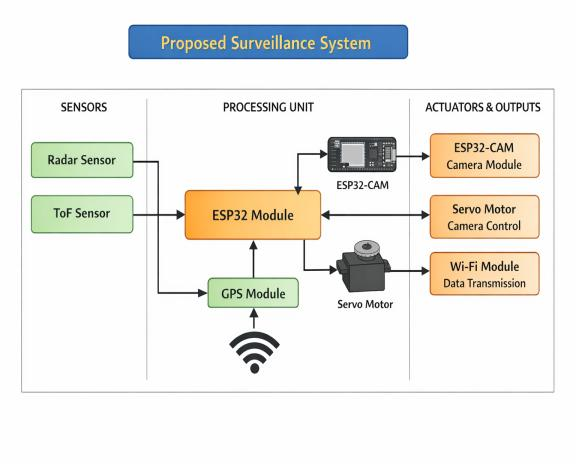
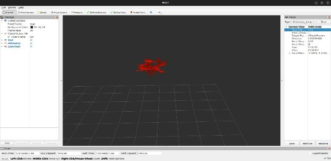
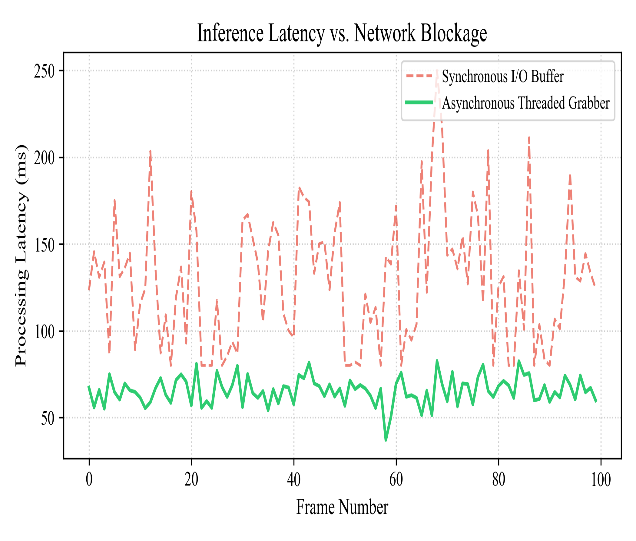
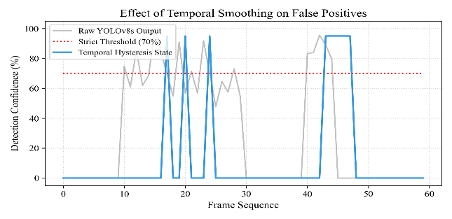
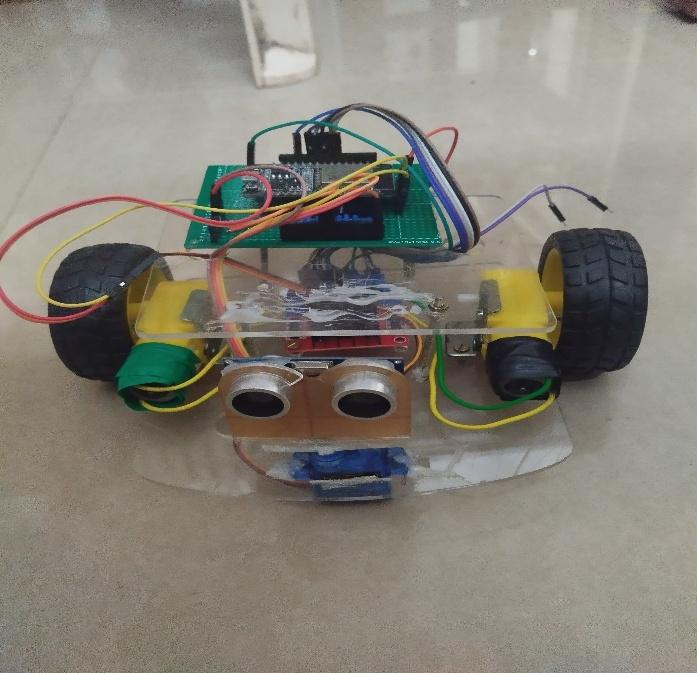
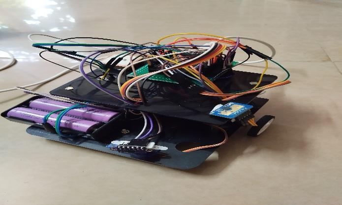
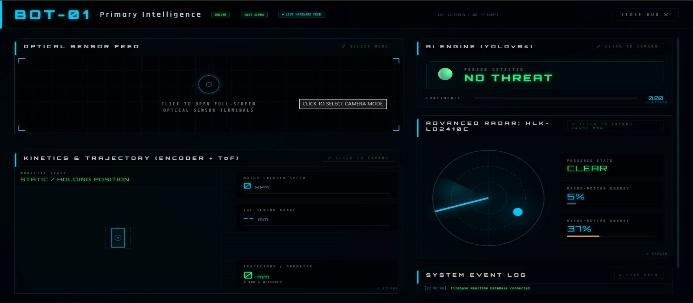
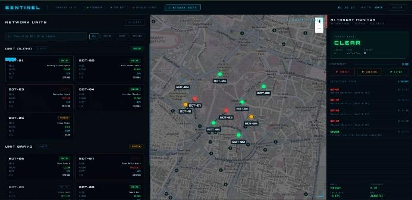

# Smart Border Surveillance System

This repository contains the source code and documentation for the **Smart Border Surveillance System**. 

## Overview
The Smart Border Surveillance System utilizes an ESP32-based SLAM (Simultaneous Localization and Mapping) robot to autonomously monitor and navigate border environments. 

## Features
- **ESP32 SLAM Bot**: Core robotics platform.
- **micro-ROS over WiFi**: Seamless integration with ROS2 ecosystems.
- **Odometry & Navigation**: Uses encoder-based odometry and publishes to `/odom`.
- **Obstacle Avoidance**: Autonomous navigation leveraging ultrasonic sensors and servo-driven sweeping.
- **Laser Scan Data**: Generates and publishes `/scan` topics for environmental mapping.

## Code Structure
- `/esp32_slam_bot/esp32_slam_bot.ino`: Main bot code (Version 1).

## System Images
Here are the architectural and demonstrative images from the research paper:

## Setup & Deployment
1. Open the `.ino` file in the Arduino IDE.
2. Install the necessary libraries (micro_ros_arduino, ESP32Servo).
3. Configure your WiFi credentials and ROS2 agent IP.
4. Flash the code to the ESP32 and run the micro-ROS agent on your machine.
